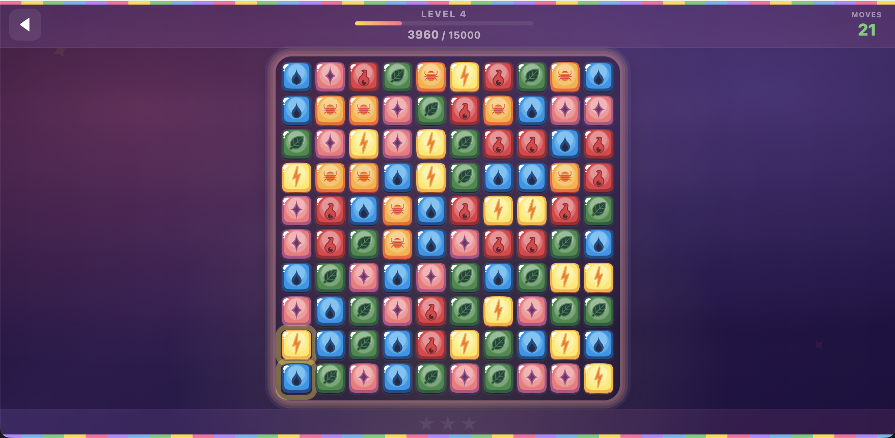

# Slide Game

A match-3 puzzle game (Candy Crush-like) built with vanilla JavaScript and DOM. No build step, no dependencies — just open in a browser.

## Play

```sh
python3 -m http.server 8000
# then open http://localhost:8000
```

## Screenshot



## Features

- 10 levels with increasing difficulty, target scores, and move limits
- 6 candy types, 5 board shapes across levels
- Special match patterns (4-row, 5-row, 2×2, L/T, cross)
- Color blast effect for cross matches
- Hint system when stuck
- Star ratings (1–3) per level
- Level progress saved to localStorage
- Loading screen with candy-themed animations
- Swipe/drag or tap-to-select input
